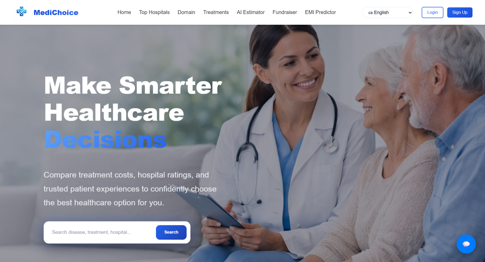
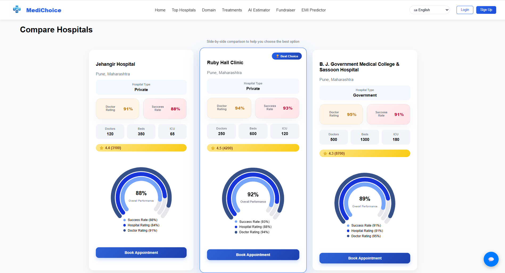
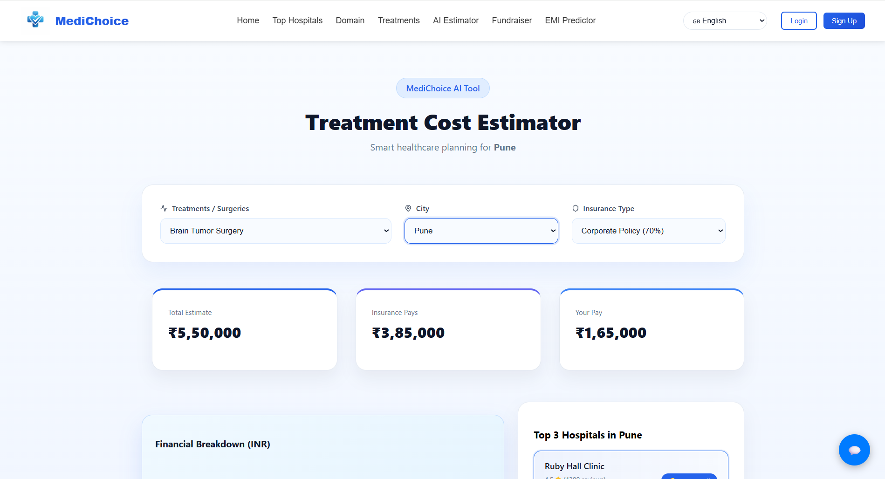

<div align="center">

# 🏥 MediChoice

### AI-Powered Healthcare Decision Support Platform

*"Making quality healthcare accessible through intelligent comparison, cost estimation, and AI-assisted guidance."*

<p align="center">


</p>

<p align="center">

🌐 Live Demo • 📖 Documentation • 🚀 Features • 📷 Screenshots

</p>

</div>

---

# 📖 Project Overview

Healthcare decisions are often difficult because patients must compare multiple hospitals, understand treatment costs, evaluate doctors, and find trustworthy information—all while managing financial constraints.

**MediChoice** is an AI-powered healthcare platform that simplifies this process by providing intelligent hospital comparison, doctor discovery, AI-powered assistance, treatment cost estimation, EMI calculation, multilingual support, and medical crowdfunding in one place.

Instead of visiting multiple websites and manually comparing hospitals, users can make informed healthcare decisions from a single platform.

---

# ❗ Problem Statement

Patients frequently face challenges while selecting healthcare providers because information is scattered across different platforms.

Some of the major problems include:

- Difficulty comparing hospitals based on cost, ratings, and facilities.
- Limited transparency in treatment expenses.
- Lack of personalized healthcare guidance.
- Language barriers for regional users.
- Financial challenges for expensive treatments.
- Time-consuming search process across multiple healthcare websites.

These issues often lead to delayed decisions and unnecessary financial burden.

---

# 💡 Solution

MediChoice addresses these challenges by integrating healthcare services into a single intelligent platform.

The platform enables users to:

- Compare hospitals based on multiple parameters.
- Explore doctor profiles and hospital information.
- Estimate treatment costs before making decisions.
- Calculate EMI options for medical expenses.
- Interact with an AI-powered healthcare chatbot.
- Translate content into multiple languages.
- Raise funds through medical crowdfunding.
- Search healthcare providers using an intuitive interface.

The objective is to make healthcare more transparent, accessible, and affordable.

---

# ✨ Key Features

## 🏥 Hospital Comparison

Compare hospitals using important healthcare metrics such as:

- Ratings
- Treatment Cost
- Facilities
- Location
- Services Offered

---

## 👨‍⚕ Doctor Discovery

Browse doctor profiles including

- Specialization
- Experience
- Hospital Association
- Profile Information

---

## 🤖 AI Healthcare Chatbot

Integrated AI chatbot capable of

- Answering healthcare-related questions
- Guiding users through the platform
- Providing quick assistance
- Improving user experience

---

## 💰 Medical Cost Estimator

Estimate treatment costs before visiting hospitals to improve financial planning.

---

## 💳 EMI Calculator

Calculate monthly installment plans for medical expenses.

---

## ❤️ Medical Crowdfunding

Allows patients to create fundraising campaigns for medical treatments.

---

## 🌍 Multi-language Translation

Translate important healthcare information into multiple languages for better accessibility.

---

## 🔐 Authentication

Secure authentication system with

- User Registration
- Login
- Session Management

---

## 📍 Hospital Location Support

Interactive location support to help users find hospitals more efficiently.

---

## 📱 Responsive Design

Fully responsive interface optimized for

- Desktop
- Tablet
- Mobile Devices

---

# 🛠 Tech Stack

## Frontend

| Technology | Purpose |
|------------|---------|
| React.js | User Interface |
| Vite | Build Tool |
| React Router | Client-side Routing |
| CSS | Styling |

---

## Backend

| Technology | Purpose |
|------------|---------|
| Node.js | Runtime Environment |
| Express.js | REST API Development |
| MongoDB | Database |
| Mongoose | Database Modeling |

---

## AI & Additional Services

| Technology | Purpose |
|------------|---------|
| AI Chatbot Service | Intelligent User Assistance |
| Translation Module | Multi-language Support |

---

# 🚀 Why MediChoice?

Unlike traditional healthcare platforms that focus on a single service, MediChoice combines multiple healthcare utilities into one integrated platform.

✅ Hospital Comparison

✅ Doctor Discovery

✅ AI Assistance

✅ Medical Cost Estimation

✅ EMI Planning

✅ Crowdfunding Support

✅ Multilingual Accessibility

This enables users to make faster, smarter, and more informed healthcare decisions.

---

# 🏗 System Architecture

```text
                          ┌──────────────────────────────┐
                          │          User                │
                          └──────────────┬───────────────┘
                                         │
                                         ▼
                    ┌──────────────────────────────────────┐
                    │        React Frontend (Vite)         │
                    │                                      │
                    │ • Home                              │
                    │ • Hospital Comparison               │
                    │ • Doctor Search                     │
                    │ • AI Chatbot                        │
                    │ • Cost Estimator                    │
                    │ • EMI Calculator                    │
                    │ • Crowdfunding                      │
                    └──────────────┬───────────────────────┘
                                   │ REST API
                                   ▼
                    ┌──────────────────────────────────────┐
                    │       Express.js Backend             │
                    │                                      │
                    │ • Authentication                    │
                    │ • Hospital APIs                     │
                    │ • Doctor APIs                       │
                    │ • Comparison Logic                  │
                    │ • Crowdfunding APIs                 │
                    └──────────────┬───────────────────────┘
                                   │
                    ┌──────────────┴──────────────┐
                    ▼                             ▼
          ┌──────────────────┐          ┌──────────────────┐
          │    MongoDB        │          │ AI Chatbot       │
          │                   │          │ Service          │
          └──────────────────┘          └──────────────────┘
```

---

# 🔄 Application Workflow

```text
User

   │

   ▼

Open MediChoice

   │

   ▼

Search Hospital / Doctor

   │

   ▼

View Details

   │

   ├──────────────► Compare Hospitals

   │

   ├──────────────► Estimate Treatment Cost

   │

   ├──────────────► Calculate EMI

   │

   ├──────────────► Chat with AI Assistant

   │

   └──────────────► Create Crowdfunding Campaign

   │

   ▼

Make Better Healthcare Decision
```

---

# 📂 Project Structure

```text
MediChoice
│
├── backend
│   ├── config
│   ├── init
│   ├── middleware
│   ├── models
│   ├── routes
│   ├── uploads
│   ├── app.js
│   ├── server.js
│   └── package.json
│
├── chatbot-service
│   ├── dData.js
│   ├── hData.js
│   ├── server.js
│   └── package.json
│
├── frontend
│   ├── public
│   ├── src
│   │
│   ├── assets
│   │
│   ├── components
│   │   ├── ChatWidget
│   │   ├── DoctorSidebar
│   │   ├── Footer
│   │   ├── HeroSection
│   │   ├── HospitalCard
│   │   ├── Loader
│   │   ├── Login
│   │   ├── Map
│   │   ├── Navbar
│   │   ├── SearchBar
│   │   ├── SignUp
│   │   ├── Testimonials
│   │   ├── Translate
│   │   └── ...
│   │
│   ├── pages
│   │   ├── Home
│   │   ├── Comparison
│   │   ├── ShowHospital
│   │   ├── ShowDoctor
│   │   ├── Crowdfunding
│   │   ├── EMI
│   │   ├── Estimator
│   │   └── ...
│   │
│   ├── styles
│   ├── utils
│   ├── data
│   └── App.jsx
│
├── README.md
└── package.json
```

---

# 📦 Core Modules

| Module | Description |
|---------|-------------|
| 🏥 Hospital Module | Displays hospital information and comparison |
| 👨‍⚕ Doctor Module | Browse doctor profiles and details |
| 🤖 AI Assistant | AI-powered healthcare chatbot |
| 💰 Cost Estimator | Estimate treatment expenses |
| 💳 EMI Calculator | Calculate monthly payment plans |
| ❤️ Crowdfunding | Create and explore fundraising campaigns |
| 🌍 Translation | Multi-language support |
| 🔐 Authentication | Secure login and registration |

---

# ⚙ Installation Guide

## 1️⃣ Clone Repository

```bash
git clone https://github.com/yourusername/MediChoice.git

cd MediChoice
```

---

## 2️⃣ Install Backend

```bash
cd backend

npm install
```

---

## 3️⃣ Install Frontend

```bash
cd ../frontend

npm install
```

---

## 4️⃣ Install Chatbot Service

```bash
cd ../chatbot-service

npm install
```

---

## 5️⃣ Configure Environment Variables

Create a `.env` file in the backend directory.

```env
PORT=5000

MONGO_URI=your_mongodb_connection

JWT_SECRET=your_secret_key
```

Create a `.env` file inside the frontend directory.

```env
VITE_API_URL=http://localhost:5000
```

*(Add any additional environment variables if your project requires them.)*

---

# ▶ Running the Project

### Start Backend

```bash
cd backend

npm start
```

---

### Start Frontend

```bash
cd frontend

npm run dev
```

---

### Start AI Chatbot

```bash
cd chatbot-service

npm start
```

---

Visit:

```
http://localhost:5173
```

---

# 📡 API Overview

| Module | Purpose |
|---------|---------|
| Authentication API | User Login & Registration |
| Hospital API | Hospital Information |
| Doctor API | Doctor Details |
| Comparison API | Compare Hospitals |
| Chatbot API | AI Chat Responses |
| Crowdfunding API | Campaign Management |

---

# 🤖 AI Chatbot Workflow

```text
User Query

      │

      ▼

React Chat Widget

      │

      ▼

Chatbot Server

      │

      ▼

Healthcare Dataset

      │

      ▼

Generate Response

      │

      ▼

Display Answer
```

---

# 🔒 Authentication Flow

```text
User

 │

 ▼

Register/Login

 │

 ▼

Backend Validation

 │

 ▼

MongoDB

 │

 ▼

Authentication Success

 │

 ▼

Access Protected Pages
```

---

# 📸 Project Screenshots

> **Replace the placeholder images below with actual screenshots of your project.**

## 🏠 Home Page

<p align="center">

</p>

---

## 🏥 Hospital Comparison

<p align="center">

</p>

---

## 👨‍⚕ Doctor Details

<p align="center">

</p>

---

## 🤖 AI Chatbot

<p align="center">

</p>

---

## 💰 Medical Cost Estimator

<p align="center">

</p>

---

## 💳 EMI Calculator

<p align="center">

</p>

---

## ❤️ Medical Crowdfunding

<p align="center">

</p>

---

# 🚀 Future Scope

Although MediChoice already provides several useful healthcare services, the platform can be extended with additional intelligent features in future versions.

### Planned Enhancements

- 📅 Complete Appointment Management System
- 👨‍⚕ Doctor Dashboard
- 👤 Patient Dashboard
- 📄 Medical Report Upload & Analysis using AI
- 🧠 Disease Prediction based on Symptoms
- 🏥 Live Hospital Bed Availability
- 💳 Online Payment Gateway
- 📹 Video Consultation
- 📱 Mobile Application
- 🔔 Real-time Appointment Notifications
- 🏥 Health Insurance Comparison
- 📊 Personalized Healthcare Recommendations

---

# 🌟 Project Highlights

- ✅ AI-powered healthcare assistant
- ✅ Intelligent hospital comparison
- ✅ Doctor discovery platform
- ✅ Medical cost estimation
- ✅ EMI calculator for healthcare expenses
- ✅ Medical crowdfunding support
- ✅ Multi-language translation
- ✅ Responsive and user-friendly interface
- ✅ Full-stack MERN architecture
- ✅ Modular and scalable project structure

---

# 🧩 Challenges Faced

During the development of MediChoice, several technical challenges were addressed, including:

- Designing a scalable MERN architecture.
- Integrating an AI chatbot into the application.
- Managing multiple healthcare modules within a single platform.
- Handling dynamic hospital and doctor data.
- Building reusable React components.
- Managing backend APIs efficiently.
- Ensuring responsive design across different devices.

These challenges significantly improved the overall software engineering and problem-solving skills gained during development.

---

# 📚 Learning Outcomes

This project helped strengthen practical knowledge in:

### Frontend Development

- React.js
- Component-Based Architecture
- Routing
- State Management
- Responsive UI Design

---

### Backend Development

- Node.js
- Express.js
- REST APIs
- Authentication
- Middleware

---

### Database

- MongoDB
- Mongoose
- Schema Design

---

### Software Engineering

- Modular Project Structure
- API Integration
- Error Handling
- Full Stack Development
- Project Documentation

---

# 🎯 Project Vision

Our vision is to make healthcare decisions easier, more transparent, and accessible for everyone by bringing essential healthcare services together on a single intelligent platform.

MediChoice aims to empower patients with the information they need to make informed decisions regarding hospitals, doctors, treatment costs, and financial planning.

---

# 📈 Project Status

| Feature | Status |
|---------|--------|
| Hospital Comparison | ✅ Completed |
| Doctor Discovery | ✅ Completed |
| Authentication | ✅ Completed |
| AI Chatbot | ✅ Completed |
| Cost Estimator | ✅ Completed |
| EMI Calculator | ✅ Completed |
| Crowdfunding | ✅ Completed |
| Translation Support | ✅ Completed |
| Interactive Maps | ✅ Completed |
| Appointment Booking (Prototype) | 🟡 Partial |
| Patient Dashboard | 🔵 Planned |
| Doctor Dashboard | 🔵 Planned |

---

# 🤝 Contributing

Contributions are welcome!

If you'd like to improve MediChoice:

1. Fork the repository.
2. Create a feature branch.
3. Commit your changes.
4. Push your branch.
5. Open a Pull Request.

---

# 📄 License

This project is licensed under the **MIT License**.

Feel free to use, modify, and distribute it in accordance with the license.

---

# 👨‍💻 Author

**Aditya Dahake**

B.Tech – Electronics & Telecommunication Engineering  
AISSMS Institute of Information Technology

### Connect with Me

- 🌐 Portfolio: *Add your portfolio link*
- 💼 LinkedIn: *Add your LinkedIn profile*
- 🐙 GitHub: *Add your GitHub profile*
- 📧 Email: *Add your email address*

---

# 🙏 Acknowledgements

Special thanks to:

- Open-source community
- React.js Community
- Node.js Community
- MongoDB Community
- Express.js Community
- Everyone who provided valuable feedback during the development of MediChoice.

---

# ⭐ Support

If you found this project useful,

please consider giving it a ⭐ on GitHub.

It motivates further development and helps others discover the project.

---

<div align="center">

## ❤️ Built with Passion for Better Healthcare

### ⭐ If you like this project, don't forget to Star the Repository ⭐

</div>
